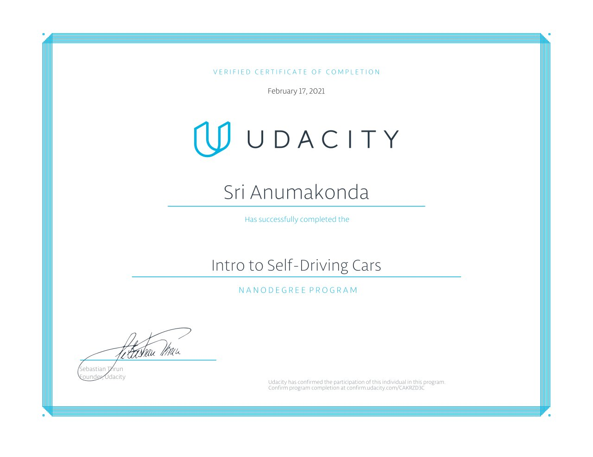

# Intro to Self Driving Cars Nanodegree
 
https://www.udacity.com/course/intro-to-self-driving-cars--nd113

Learned about:
- Localization
- Kalman Filters
- C++
- Calculus (derivatives, integrals)
- Computer Vision (OpenCV)
- Bayesian Thinking

The projects in this repo are the main projects required for submission. I had chosen to include only the code for the main projects with hope that I can inspire someone with their nanodegree.

